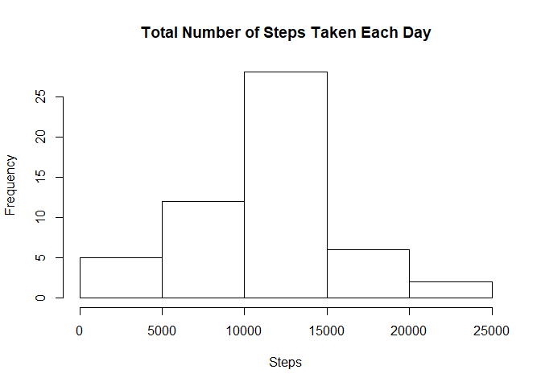
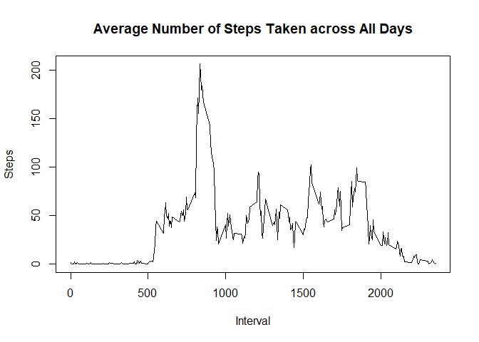
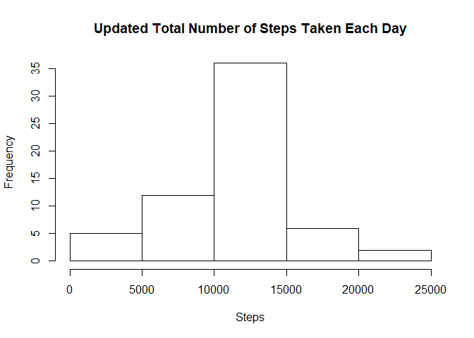

## Loading and preprocessing the data

Show any code that is needed to
1.Load the data (i.e. read.csv())
2.Process/transform the data (if necessary) into a format suitable for your analysis


```r
setwd("C:/Users/bib1/Documents/RStudio/MyProject/Module5Class2")
fileurl = 'https://d396qusza40orc.cloudfront.net/repdata%2Fdata%2Factivity.zip'
if (!file.exists('./repdata_data_activity.zip')){
  download.file(fileurl,'./repdata_data_activity.zip', mode = 'wb')
  unzip("repdata_data_activity.zip", exdir = getwd())
}
activity<- read.csv("activity.csv")
```
## What is mean total number of steps taken per day?


```r
library(datasets)
#Calculate the total number of steps taken per day
sumSteps <- aggregate(steps ~ date, activity, sum)

#plot histogram of the total number of steps taken each day and calculate mean and median
hist(sumSteps$steps, main="Total Number of Steps Taken Each Day", xlab="Steps")
```

<!-- -->

```r
mean(sumSteps$steps)
```

```
## [1] 10766.19
```

```r
median(sumSteps$steps)
```

```
## [1] 10765
```
## What is the average daily activity pattern?


```r
library(datasets)
meanSteps <- aggregate(steps ~ interval, activity, mean)
plot(meanSteps$interval,meanSteps$steps,type="l",main="Average Number of Steps Taken across All Days", xlab="Interval", ylab="Steps")
```

<!-- -->

```r
#which interval has the maximum number of steps
maxInterval <- meanSteps$interval[which.max(meanSteps$steps)]
print(maxInterval)
```

```
## [1] 835
```
## Imputing missing values


```r
#Calculate total number of missing values in the dataset 
good<-complete.cases(activity)
nrow(activity[!good,])
```

```
## [1] 2304
```

```r
#Use the mean for that 5-minute interval to fill in missing values
activity1<-activity
activity1$steps[!good]<-meanSteps$steps[match(meanSteps$interval,(activity$interval[!good]))]

#plot histogram of the total number of steps taken each day and calculate mean and median
sumSteps1 <- aggregate(steps ~ date, activity1, sum)
hist(sumSteps1$steps, main="Updated Total Number of Steps Taken Each Day", xlab="Steps")
```

<!-- -->

```r
mean(sumSteps1$steps)
```

```
## [1] 10766.19
```

```r
median(sumSteps1$steps)
```

```
## [1] 10766.19
```
The result shows that the mean did not change while the median changed, indicating that missing values are equally spread out across different time intervals.

## Are there differences in activity patterns between weekdays and weekends?


```r
library(datasets)
library(lattice)
#Create a new facotr for weekday vs weekend
activity1$week <- ifelse(weekdays(as.Date(as.character(activity$date))) %in% c("Saturday", "Sunday"), "weekend", "weekday")

#Make a panel plot of a time seris plot and the average number of steps taken
meanSteps1week<-aggregate(steps~interval+week, activity1, mean)
xyplot(steps ~ interval | week, meanSteps1week, type = "l", layout = c(1, 2), 
    xlab = "Interval", ylab = "Number of steps")
```

<!-- -->
